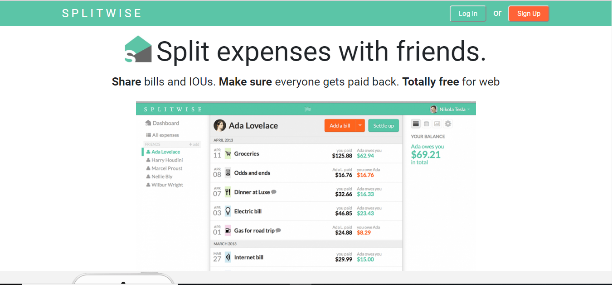

# Split Share

Split Share is a clone of the popular expense-sharing app Splitwise. It allows users to share expenses with friends, keep track of balances, and settle debts seamlessly. This application is built using ReactJS for the frontend, Node.js and Express for the backend, and MySQL for the database.

 

## Table of Contents

- [Features](#features)
- [Installation](#installation)
- [Usage](#usage)
- [API Endpoints](#api-endpoints)

## Features

- **User Authentication**: Sign up, log in, and manage user profiles.
- **Group Management**: Create and manage groups of friends or roommates.
- **Expense Tracking**: Add, view, and edit expenses shared within groups.
- **Balances and Settlements**: View individual balances and settle debts.
- **Notifications**: Receive notifications for new expenses and settlements.
- **Responsive Design**: Accessible on both desktop and mobile devices.

## Installation

### Prerequisites

- Node.js (v14 or higher)
- MySQL

### Backend Setup

1. Clone the repository:

    ```bash
    git clone https://github.com/your-username/split-share.git
    cd split-share/backend
    ```

2. Install dependencies:

    ```bash
    npm install
    ```

3. Set up the MySQL database:

    - Create a database named `splitshare`.
    - Import the database schema from `schema.sql` file.

4. Configure environment variables:

    Create a `.env` file in the `backend` directory and add the following:

    ```env
    DB_HOST=localhost
    DB_USER=root
    DB_PASSWORD=yourpassword
    DB_NAME=splitshare
    JWT_SECRET=your_jwt_secret
    ```

5. Start the backend server:

    ```bash
    npm start
    ```

### Frontend Setup

1. Navigate to the frontend directory:

    ```bash
    cd ../frontend
    ```

2. Install dependencies:

    ```bash
    npm install
    ```

3. Start the frontend development server:

    ```bash
    npm start
    ```

The application should now be running on `http://localhost:3000`.

## Usage

1. **Sign Up**: Create a new account by signing up with your email.
2. **Create Group**: Create a group and invite friends to join.
3. **Add Expense**: Add expenses within the group and specify how the cost should be split.
4. **View Balances**: Check your balances with each group member.
5. **Settle Debts**: Settle debts and update balances accordingly.

## API Endpoints

### User Routes

- `POST /api/auth/signup`: Create a new user.
- `POST /api/auth/login`: Log in a user.
- `GET /api/users/profile`: Get user profile.

### Group Routes

- `POST /api/groups`: Create a new group.
- `GET /api/groups`: Get all groups for the logged-in user.
- `GET /api/groups/:id`: Get details of a specific group.

### Expense Routes

- `POST /api/expenses`: Add a new expense to a group.
- `GET /api/expenses/group/:groupId`: Get all expenses for a group.
- `PUT /api/expenses/:id`: Update an expense.

### Balance Routes

- `GET /api/balances/group/:groupId`: Get balances for a group.
- `POST /api/balances/settle`: Settle balances between users.
